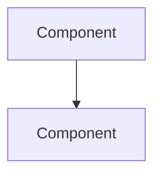

Research the codebase deeply for plan:

**Plan index:** $ARGUMENTS

## Prerequisites

1. **Load config** — read `.claude/plan-config.json`. If missing, tell user to run `/plan:init` first and stop.

2. **Find the plan** — Find the directory matching `{index}-*` in `{planningDir}/` and read `PLAN.md` from it. If not found, list available plans. If `$ARGUMENTS` is empty, list plans and ask user to pick.

3. **Verify status** — Plan must have `status: draft`. If already researched/approved, warn user.

## Phase 1: Deep Codebase Research

Spawn an **Explore** agent (subagent_type: "Explore", thoroughness: "very thorough") with this prompt:

> Deep research for implementing: {plan title and goal from PLAN.md}
>
> 1. Read ALL project conventions:
>    - `CLAUDE.md` in the repo root
>    - All files matching `.claude/rules/*.md`
>    - Any subdirectory `CLAUDE.md` files relevant to the task (e.g. `modules/CLAUDE.md`, `front/CLAUDE.md`)
> 2. Identify ALL affected files — trace through the full call chain
> 3. Find existing patterns for similar features (how were similar things done before?)
> 4. Map dependencies and integration points
> 5. Check current library versions in go.mod / package.json where relevant
> 6. Note constraints from project rules
> 7. Look for potential conflicts with existing code
>
> Return a detailed structured summary with: conventions, all affected files (with line ranges), existing patterns to follow, dependencies, constraints, potential conflicts.

## Phase 2: Third-Party Research (if needed)

If the plan involves new libraries, external APIs, or unfamiliar tech:

1. **Check current versions** — Read `go.mod`, `front/package.json`, etc. to find what's already used
2. **WebSearch** for:
   - Latest stable versions of any new libraries needed
   - Current best practices and migration guides
   - API documentation for external services
   - Known issues or gotchas
3. **WebFetch** relevant documentation pages for specifics

## Phase 3: Discovery Q&A

Based on research findings, discuss design decisions with the user.

1. **Analyze gaps** — Review research and identify:
   - Ambiguous requirements (multiple valid interpretations)
   - Design choices where >1 approach exists (with trade-offs)
   - Constraints you cannot determine from code alone
   - Scope boundaries that need confirmation

2. **Ask targeted questions** — Use `AskUserQuestion` to ask 2-4 focused questions. Each should:
   - Reference specific research findings ("I found X pattern in the codebase...")
   - Present concrete options with trade-offs, not open-ended questions
   - Include a recommended option where you have a clear preference

3. **Iterate if needed** — If answers surface new ambiguities, ask 1-2 follow-up questions. Stop when all design decisions are resolved.

## Phase 4: Write RESEARCH.md

Write `{planDir}/RESEARCH.md` with all findings:

```markdown
---
tags: [research]
created: {ISO date}
plan: "[[PLAN]]"
---

# Research: {Plan Title}

## Conventions & Constraints

{Project conventions relevant to this plan — from CLAUDE.md and rules}

## Codebase Analysis

### Affected Files

| File | Current Purpose | Required Changes |
|------|----------------|-----------------|
| `{path}` | {what it does} | {what needs to change} |

### Existing Patterns

{How similar features are implemented in the codebase. Include specific code references.}

### Dependencies & Integration Points

{What this feature connects to, what might break, what needs to be coordinated}

## Third-Party Research

{Only if applicable — library versions, API docs, best practices discovered}

| Library/API | Version | Notes |
|-------------|---------|-------|
| {name} | {version} | {key findings} |

## Design Decisions

> [!info] Decisions made during research Q&A

> [!question] {Question 1}
> {Context}

> [!answer] {Answer 1}
> {User's response}

{Repeat for all Q&A pairs}

## Architecture

> [!tip] Key Design Decisions
> {Bulleted list of architectural choices and WHY — informed by research and Q&A}

{Architecture description. Use Mermaid diagrams where helpful:}



## Risks & Concerns

> [!warning] Risks
> {Anything that could go wrong, edge cases, potential conflicts}

## Notes

{Any additional context, observations, or things to keep in mind during planning}
```

## Phase 5: Update Plan Status

Update `PLAN.md` frontmatter: `status: researched`

## Phase 6: Present Summary

Show:

---

### Research Complete: {Title}

**Files affected:** {count}
**Key decisions:** {1-2 most important decisions}
**Risks:** {top risk if any}

**Research saved to:** `{path}/RESEARCH.md`

---

Then tell user: "Run `/plan:plan {index}` to break this down into implementation tasks."
